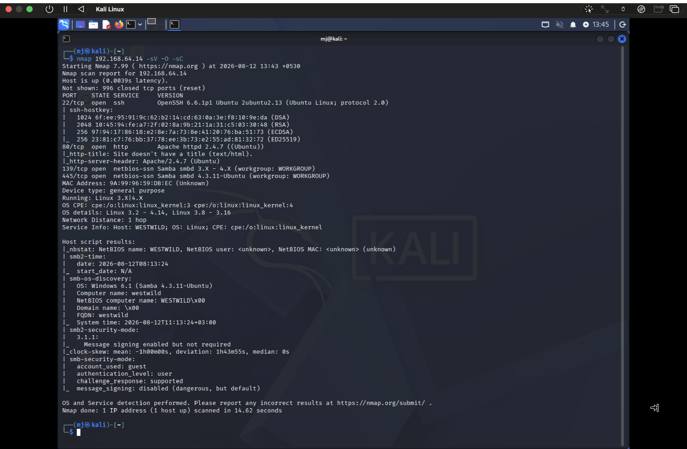
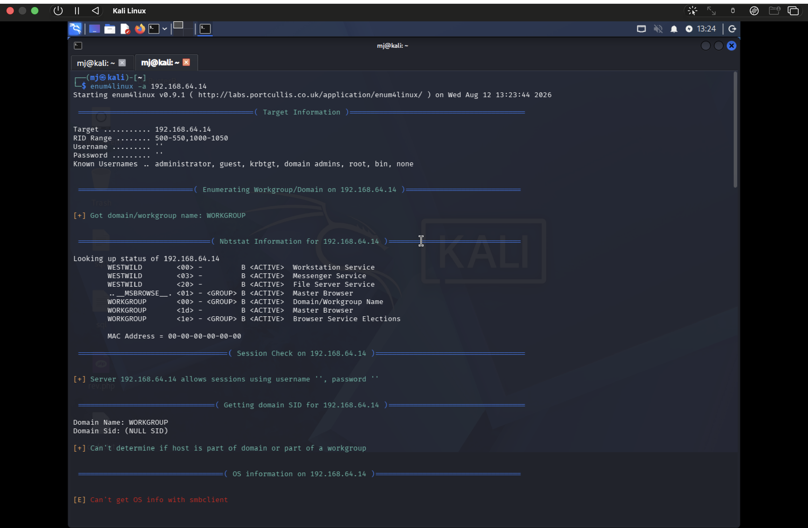
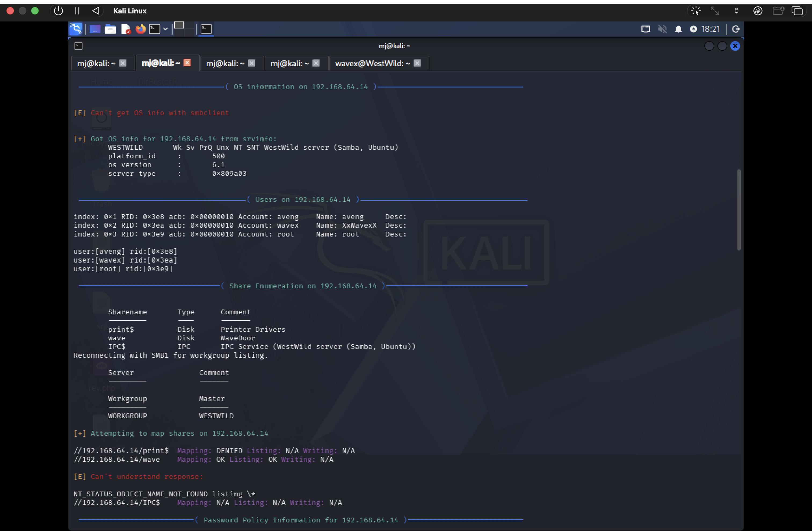
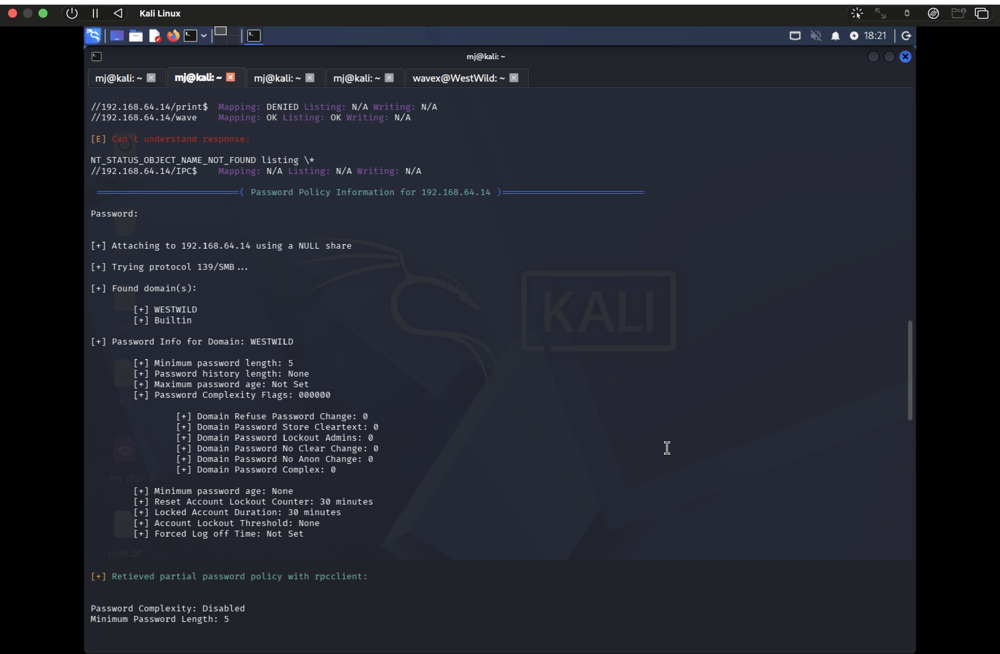
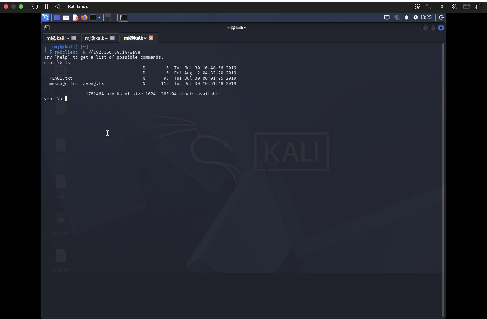
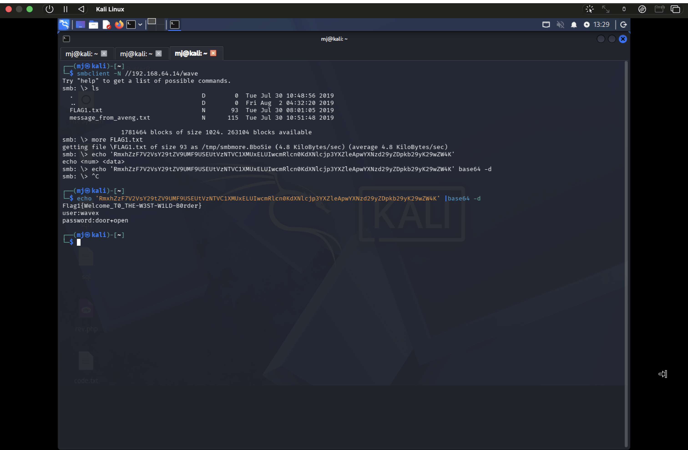
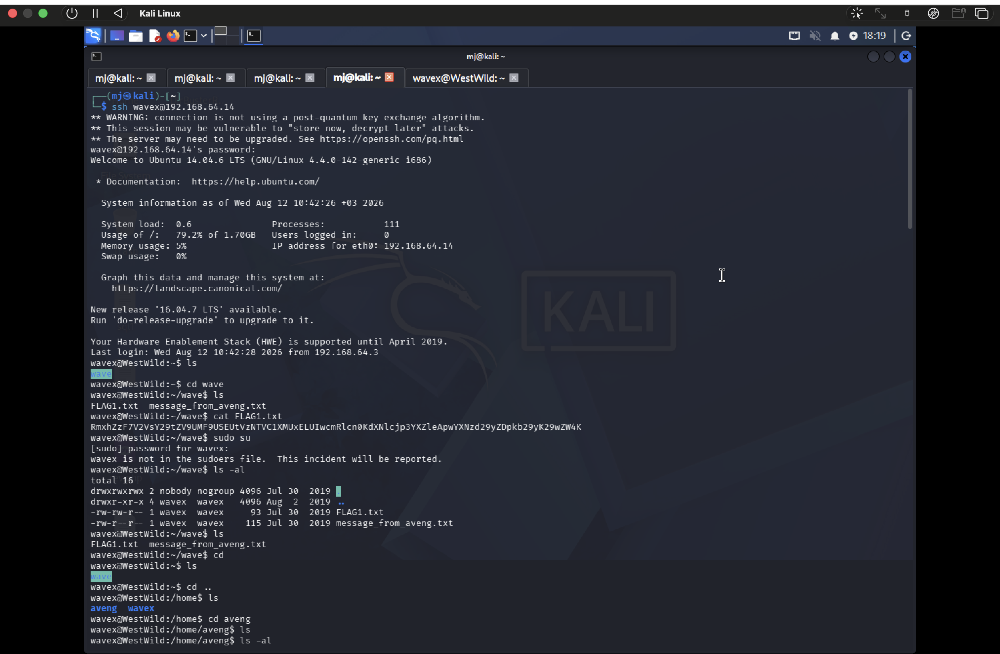
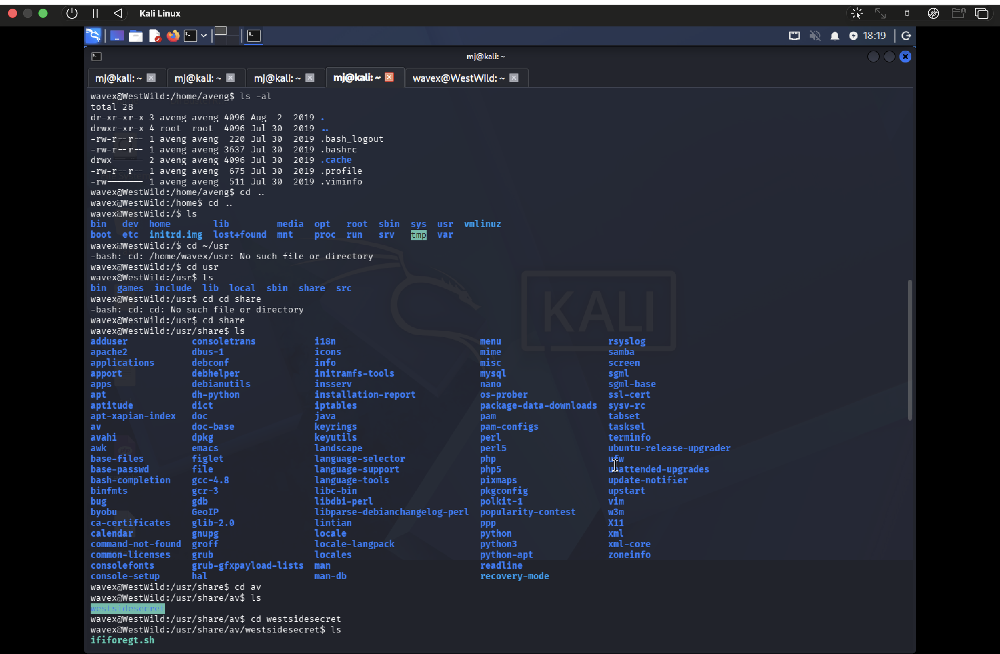
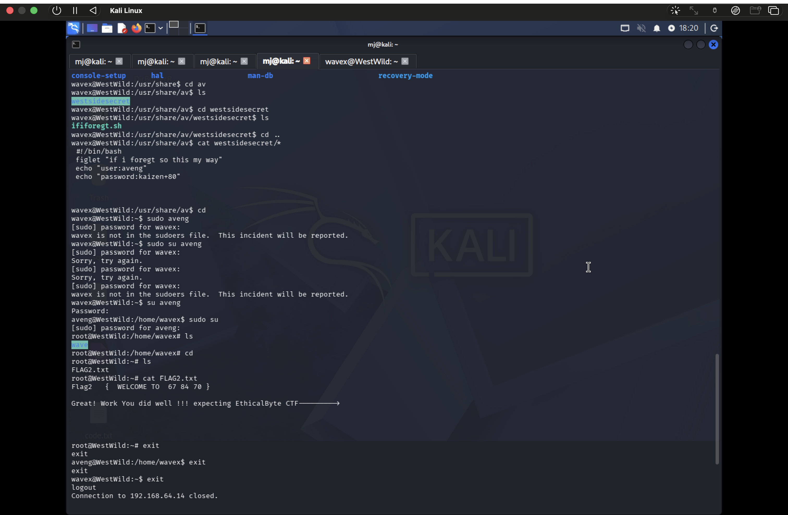

# WestWild: 1 — Boot-to-Root Penetration Test Walkthrough

A black-box penetration test of the **WestWild: 1** vulnerable Linux machine, taken from an unauthenticated network position all the way to **root**. Both flags captured. This write-up documents the full methodology — reconnaissance, enumeration, credential access, foothold, lateral movement, and privilege escalation — with terminal evidence for every stage.

> **Lab / educational project.** WestWild is a deliberately vulnerable boot-to-root virtual machine. All testing was performed against my own copy on an **isolated virtual network** (private `192.168.64.x` addresses). Never test systems you don't own or lack permission to assess.

📄 **Full professional report (PDF):** [WestWild_Penetration_Test_Report.pdf](westwild-ctf-writeup/WestWild_Penetration_Test_Report.pdf) — a formal 14-page penetration test report: cover page, executive summary, methodology, a step-by-step attack narrative with evidence, and a findings & remediation section with severity ratings.

---

## Target

| | |
|---|---|
| **Target host** | 192.168.64.14 (hostname: WESTWILD) |
| **Attacking host** | 192.168.64.3 (Kali Linux) |
| **Type** | Capture-the-Flag / vulnerable VM (black-box) |
| **Objective** | Obtain root access and capture all flags |
| **Outcome** | ✅ Fully compromised — root achieved, 2 flags captured |

---

## Attack chain at a glance

```
Nmap recon → SMB enumeration → anonymous share read → FLAG 1 + wavex creds
   → SSH foothold as wavex → credential leak in world-readable script
   → lateral move to aveng → sudo misconfiguration → root → FLAG 2
```

The box falls not to a single exploit but to a **chain of misconfigurations** — each one individually small, but together enough for full compromise.

---

## 1. Reconnaissance — Nmap

```bash
nmap 192.168.64.14 -sV -O -sC
```

Three services exposed:

| Port | Service | Version |
|------|---------|---------|
| 22/tcp | SSH | OpenSSH 6.6.1p1 (Ubuntu) |
| 80/tcp | HTTP | Apache httpd 2.4.7 (Ubuntu) |
| 139/445 | SMB | Samba 4.3.11 (workgroup WORKGROUP) |

The scan also flagged **SMB message signing disabled** and **guest access permitted** — a strong hint that anonymous SMB enumeration would pay off.



## 2. SMB Enumeration — enum4linux

```bash
enum4linux -a 192.168.64.14
```

Anonymous (null-session) enumeration succeeded and revealed:
- **Users:** `aveng`, `wavex`, `root`
- **Shares:** `print$`, `wave` (commented *"WaveDoor"*), `IPC$`
- **Weak password policy:** minimum length 5, complexity **disabled**





## 3. Anonymous Share Access — First Flag

The `wave` share allowed anonymous read. It held two files: `FLAG1.txt` and `message_from_aveng.txt`.

```bash
smbclient -N //192.168.64.14/wave
smb: \> ls
smb: \> get FLAG1.txt
```



`FLAG1.txt` was Base64-encoded. Decoding it revealed the first flag **and** SSH credentials for the `wavex` user:

```bash
echo 'RmxhZ...ZW9wZW4K' | base64 -d
```

- 🚩 **FLAG 1** — `Flag1{Welcome_T0_THE-W3ST-W1LD-B0rder}`
- 🔑 Recovered credentials — `wavex : door+open`



## 4. Initial Foothold — SSH as wavex

```bash
ssh wavex@192.168.64.14      # password: door+open
```

A check of privileges (`sudo su` / `sudo -l`) confirmed **wavex is not in the sudoers file** — no direct path to root. Time to pivot through another user.



## 5. Horizontal Privilege Escalation — wavex → aveng

Enumerating the filesystem led to a hidden directory with a **world-readable** script that hardcoded another user's password in plaintext:

```bash
cd /usr/share/av/westsidesecret/
cat *
# echo "user:aveng"
# echo "password:kaizen+80"
```



```bash
su aveng      # password: kaizen+80
```

## 6. Vertical Privilege Escalation — aveng → root

As `aveng`, a fresh `sudo -l` was decisive — the account could run **any command as any user**, the classic `(ALL : ALL) ALL` misconfiguration:

```bash
aveng@WestWild:~$ sudo su
root@WestWild:~# cd /root
root@WestWild:~# cat FLAG2.txt
```

- 🚩 **FLAG 2** — `Flag2 { WELCOME TO 67 84 70 }`
- ✅ **Root access confirmed — target fully compromised.**



---

## Findings & Remediation

| # | Finding | Severity | Fix |
|---|---------|----------|-----|
| 1 | Anonymous (guest) SMB share readable | High | Disable guest/null sessions (`map to guest = never`, `restrict anonymous = 2`) |
| 2 | Credentials & flag stored on an open share | High | Remove sensitive files from readable shares; least-privilege permissions |
| 3 | Plaintext password in a world-readable script | Critical | Remove hardcoded creds; fix permissions (no world-readable 777 files) |
| 4 | `aveng` granted unrestricted sudo `(ALL:ALL) ALL` | Critical | Replace with a minimal, explicit command allow-list; audit `/etc/sudoers` |
| 5 | Outdated OpenSSH / Apache / Samba | Medium | Patch and upgrade to supported versions |

Remediating **any single** item would have broken the chain to root.

---

## What I practised

- Black-box methodology: recon → enumeration → access → escalation
- SMB enumeration and anonymous access (`enum4linux`, `smbclient`)
- Recognising and decoding encoded data (Base64)
- Manual privilege escalation via **credential leakage** and **sudo misconfiguration**
- Chaining low-severity issues into full compromise
- Writing a structured penetration test report with findings and remediation

## Tools

`Nmap` · `enum4linux` · `smbclient` · `rpcclient` · `SSH` · `Base64` · `Linux CLI` · `Kali Linux`

---

## Disclaimer

Performed in a personal, isolated lab on a machine I control, for educational purposes only. Do not use these techniques against systems without explicit authorization.
